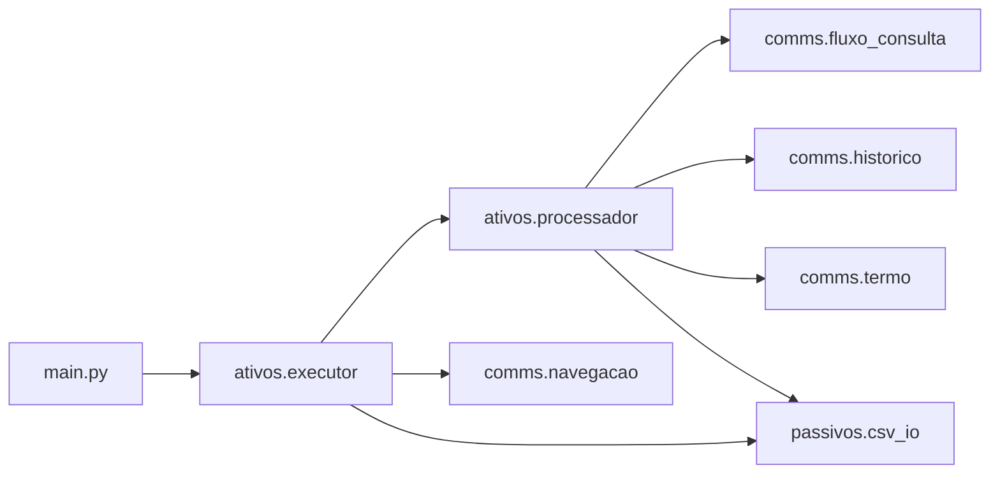

# RoboPrata — Documentação

Automação de **consulta de margem CLT** no ecossistema Banco Prata (admin + fluxo CLT), com simulação por prazos (QiTech e Celcoin) e geração de CSV.

## Documentação por pasta

| Pasta | Descrição |
|-------|-----------|
| [robo/README.md](robo/README.md) | Pacote principal, configuração e visão geral |
| [robo/ativos/README.md](robo/ativos/README.md) | Orquestração: Playwright, loop de clientes e bancos |
| [robo/comms/README.md](robo/comms/README.md) | Interação com a UI (login, consulta, histórico, termo) |
| [robo/passivos/README.md](robo/passivos/README.md) | Modelos, CSV de entrada/saída e utilitários |

## Como executar

Na raiz do repositório (recomendado):

```bash
python main.py
```

Argumentos opcionais:

| Argumento | Descrição |
|-----------|-----------|
| `--entrada` | Caminho do CSV de clientes (padrão: `robo/entrada/clientes.csv`) |
| `--saida` | Pasta onde será gravado o CSV de resultado (padrão: `robo/saida/`) |
| `--headless` | Executa o Chromium sem janela visível |

Variável de ambiente:

- `ROBO_HEADLESS` — se `1`, `true` ou `yes`, equivale a `--headless`.

## Credenciais

Não commite senhas. Use arquivo `.env` na raiz com:

- `ADMIN_EMAIL` — e-mail do usuário admin  
- `ADMIN_SENHA` — senha  

O carregamento é feito por [`credenciais.py`](credenciais.py) / [`robo/credenciais.py`](robo/credenciais.py) via `python-dotenv`.

## Arquivos na raiz do projeto

| Arquivo | Função |
|---------|--------|
| `main.py` | Ponto de entrada CLI; chama `executar_robo` |
| `config.py` | Reexporta `robo.config` para imports a partir da raiz |
| `credenciais.py` | `ADMIN_EMAIL` / `ADMIN_SENHA` a partir do ambiente |
| `robo_consulta_margem.py` | Reexporta `executar_robo` (uso como módulo) |

## Fluxo de execução (alto nível)



1. Lê clientes do CSV ([`passivos/csv_io`](robo/passivos/README.md)).  
2. Abre o navegador, faz login e navega até a consulta CLT ([`comms/navegacao`](robo/comms/README.md)).  
3. Para cada cliente e cada banco (QiTech, Celcoin), preenche CPF, consulta, trata modal/termo quando necessário e, em caso de sucesso, abre o resultado e roda simulações por meses ([`ativos/processador`](robo/ativos/README.md) + [`comms/historico`](robo/comms/README.md)).  
4. Grava o CSV final em `robo/saida/` com prefixo `resultado_` e data/hora.

## Pastas de dados

- `robo/entrada/` — CSV de entrada (ex.: `clientes.csv` com colunas `nome`, `cpf`; opcionais `contato`, `email`).  
- `robo/saida/` — CSV gerados automaticamente; não versionar dados sensíveis.

## Dependências

- Python 3 com **Playwright** (Chromium), **pandas**, **python-dotenv**.  
- Instalar browsers do Playwright conforme a documentação oficial do projeto (`playwright install`).

---

*Para detalhes por módulo, abra os READMEs nas subpastas de `robo/` listados acima.*
