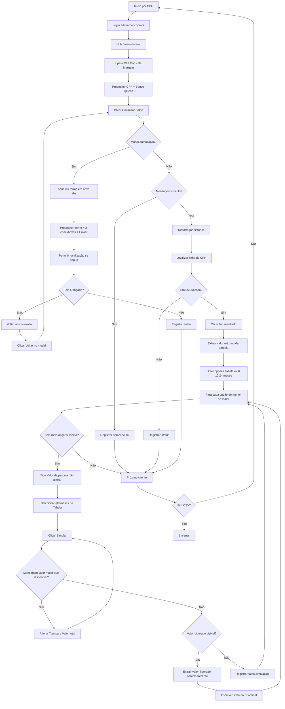

# Plano: Robô de pesquisa – Consulta Margem Banco Prata

O projeto **RoboPrata** está vazio hoje; a implementação será feita do zero. Abaixo está o escopo até “extrair valor máximo da parcela” (escopo completo: simulação por parcelas + CSV final).

---

## 1. Stack e estrutura do projeto

- **Linguagem:** Python 3.
- **Automação:** **Playwright** (recomendado) ou Selenium. Playwright lida bem com múltiplas abas, modais e espera por elementos; Selenium é alternativa válida.
- **Credenciais:** Arquivo `credenciais.py` (ou `.env` + `python-dotenv`) na raiz, com variáveis como `ADMIN_EMAIL` e `ADMIN_SENHA` para login em `https://admin.bancoprata.com.br/`. O arquivo deve ser ignorado no versionamento (`.gitignore`).
- **Entrada:** CSV com colunas exatas: `nome`, `cpf`, `contato`, `email`. Encoding UTF-8; separador `,` ou `;`.
- **Estrutura sugerida:**
  - `credenciais.py` ou `.env` – credenciais do admin (não versionar).
  - `requirements.txt` – `playwright` (ou `selenium`) e dependências.
  - `robo_consulta_margem.py` – script principal (ou um pacote `robo/` com módulos separados por etapa, se preferir).
  - Pasta `entrada/` para o CSV de entrada (opcional).
  - Pasta `saida/` (ou caminho configurável) para o CSV final: uma linha por parcela, colunas nome, cpf, contato, email, valor_maximo_parcela, qtd_parcelas, valor_liberado, valor_parcela, valor_total, status.

---

## 2. Fluxo principal (por linha do CSV)

---

## 3. Etapas técnicas (ordem sugerida)

### 3.1 Setup e credenciais

- Criar `requirements.txt` com `playwright` (e `python-dotenv` se usar `.env`). Comando `playwright install` para browsers.
- Criar `credenciais.py` (ex.: `ADMIN_EMAIL`, `ADMIN_SENHA`) ou `.env` e carregar no script. Nunca commitar credenciais.

### 3.2 Leitura do CSV

- Ler CSV (nome, cpf, contato, email); normalizar CPF (só dígitos ou máscara 000.000.000-00 conforme o site aceitar).
- Iterar por cada linha como “um cliente” para o fluxo abaixo.

### 3.3 Login e navegação (uma vez por execução ou por sessão)

- Abrir browser (recomendado: headed para debug; opção headless depois).
- Acessar `https://admin.bancoprata.com.br/`.
- Preencher campo **E-mail** e **Senha** e clicar em **Fazer login**.
- Esperar redirecionamento para `https://admin.bancoprata.com.br/hub`.
- No menu lateral esquerdo, clicar na opção que leva a **Consulta Margem** (CLT) e garantir que a URL seja `https://admin.bancoprata.com.br/clt/consultar`. Usar seletor estável (texto “Consulta Margem”, ícone da calculadora ou atributos do menu).

### 3.4 Consulta Margem (por cliente)

- Na página `/clt/consultar`:
  - Preencher campo **CPF** (formato aceito pelo site, ex.: 000.000.000-00).
  - Selecionar **Banco** = **QITech** (dropdown; tratar se for componente customizado).
  - Clicar no botão **Consultar saldo**.
- Espera: pode aparecer modal “Solicite a autorização do cliente” ou mensagem de erro (“não possui vínculos empregatícios ativos”) ou a consulta ir direto para o histórico.

### 3.5 Fluxo do modal de autorização (quando o modal aparecer)

- Detectar o modal “Solicite a autorização do cliente” (z-index alto; título ou texto característico).
- Extrair o **link** do termo (ex.: `https://assina.bancoprata.com.br/credito-trabalhador/termo-autorizacao?d=...`).
- Abrir esse link em **nova aba** (não fechar a aba atual de consulta).
- Na nova aba (termo):
  - Preencher **CPF**, **Nome**, **E-mail**, **Número de telefone** com os dados da linha do CSV.
  - Marcar os **três checkboxes** (termos de autorização; não estou em aviso prévio; contrato ativo sem previsão de encerramento).
  - Se surgir popup de **permissão de localização**, aceitar (Allow).
  - Clicar no botão **ENVIAR**.
- Esperar tela de sucesso: “Obrigado! Com a sua autorização vamos consultar a sua margem para saque.”
- Fechar a aba do termo (ou apenas mudar o contexto) e voltar para a aba **Consulta Margem**.
- Na página de consulta, o modal ainda estará aberto: clicar no botão **Voltar** do modal.
- Repetir a consulta para o **mesmo CPF**: preencher CPF, QITech, **Consultar saldo** de novo.

### 3.6 Tratamento de erro “vínculo empregatício”

- Após “Consultar saldo”, verificar se aparece a mensagem (ex.: “Este cliente não possui vínculos empregatícios ativos”) – em alerta/caixa de mensagem (e possivelmente botão X para fechar).
- Se aparecer: registrar esse cliente como “sem vínculo” (ou equivalente) e seguir para o próximo da lista; não tentar recarregar histórico nem “Ver resultado” para esse CPF.

### 3.7 Histórico de consultas e valor máximo da parcela

- Se **não** aparecer o modal de autorização nem a mensagem de “vínculo”:
  - Clicar no botão **Recarregar** da seção “Histórico de consultas”.
  - Esperar a tabela atualizar (wait para a linha do CPF ou para o botão “Ver resultado” daquele CPF).
- Na tabela, localizar a **linha do CPF** do cliente atual.
- Verificar a coluna **Status**: se for “Sucesso”:
  - Clicar no botão **Ver resultado** dessa linha.
  - Esperar a linha expandir e ler o **Valor máximo da parcela** (ex.: “R$ 977,96”).
  - Guardar esse valor (e o CPF/nome) na estrutura de resultado em memória.
- Se status não for “Sucesso”, registrar o status (erro/timeout) e seguir para o próximo.

### 3.8 Seletores e robustez

- Usar esperas explícitas (ex.: `page.wait_for_selector`, `expect(locator).to_be_visible()`) em vez de `time.sleep` fixos.
- Preferir seletores estáveis: `data-testid`, `aria-label`, ou hierarquia semântica (labels + inputs). Fallback: texto visível (“Consultar saldo”, “Ver resultado”, “Recarregar”, “Voltar”, “QITech”) quando o DOM não tiver IDs.
- Modal: seletor por texto “Solicite a autorização do cliente” ou container com z-index alto; link por atributo `href` que contenha `assina.bancoprata.com.br/credito-trabalhador/termo-autorizacao`.
- Tabela histórico: identificar linha por CPF (texto da célula “Cliente”) e então o botão “Ver resultado” na mesma linha; após expandir, localizar o texto “Valor máximo da parcela” e o valor em seguida (regex ou split para número).

### 3.9 Simulação por quantidade de parcelas (após “Ver resultado”)

- Manter o dropdown **Tipo** em **“Valor da parcela”** (não alterar).
- Obter as opções do dropdown **Tabela** (ex.: “6 meses”, “12 meses”, “24 meses”). Ordenar pela quantidade de meses (menor primeiro) e iterar nessa ordem.
- Para cada opção de Tabela:
  - Selecionar a opção no dropdown **Tabela** (ex.: “6 meses”).
  - Clicar no botão **Simular**.
  - **Se aparecer a mensagem de erro** “O valor desejado é maior que o disponível” (ou similar, ex.: “O valor desejado é maior que o disponível de R$ 977,96”):
    - Alterar o dropdown **Tipo** de “Valor da parcela” para **“Valor total”**.
    - Clicar em **Simular** novamente (mesma quantidade de parcelas).
  - **Se aparecer resultado positivo:** a seção “Valor Liberado” e “Entenda os encargos…” ficam visíveis. Extrair (ver 3.10).
  - **Se nem erro nem sucesso:** registrar falha de simulação para aquela qtd_parcelas e seguir para a próxima opção de Tabela.
- Após processar todas as opções de Tabela do cliente, seguir para o próximo cliente.

### 3.10 Extração dos dados da simulação e CSV final

- **Condição de sucesso:** presença de “Valor Liberado” e da seção “Entenda os encargos dessa antecipação e os valores detalhados:”.
- **Dados a extrair por simulação bem-sucedida:**
  - **Valor Liberado** (ex.: R$ 3.951,98).
  - **Valor de emissão** (ex.: R$ 4.029,53).
  - **Parcelas** (ex.: “6x R$ 977,84”) → extrair `qtd_parcelas` (6) e `valor_parcela` (977,84).
  - **Última parcela** (ex.: 28/10/2026) – opcional para o CSV se quiser.
  - **IOF**, **Taxas**, **CET** – opcional.
  - **Total** (ex.: R$ 5.867,04) → `valor_total`.
- **CSV final:** um arquivo com **uma linha por combinação cliente + quantidade de parcelas** (cada simulação bem-sucedida vira uma linha).
- **Colunas do CSV final:**  
`nome`, `cpf`, `contato`, `email`, `valor_maximo_parcela`, `qtd_parcelas`, `valor_liberado`, `valor_parcela`, `valor_total`, `status`.
- **Status** por linha: ex.: `sucesso`, `valor_maior_que_disponivel` (após trocar para Valor total e mesmo assim falhar ou não preencher), `falha_simulacao`, `sem_vinculo` (cliente não entrou na simulação). Escrever no CSV ao final de cada cliente ou em append por linha para não perder dados em caso de queda.

---

## 4. Saída

- **CSV final** com colunas: `nome`, `cpf`, `contato`, `email`, `valor_maximo_parcela`, `qtd_parcelas`, `valor_liberado`, `valor_parcela`, `valor_total`, `status`.
- Uma linha para cada parcela simulada com sucesso (e linhas com status de erro quando fizer sentido, ex.: sem_vinculo, falha_simulacao).
- Arquivo em UTF-8; separador `,` ou `;` conforme padrão do projeto. Caminho do arquivo de saída configurável (ex.: `saida/resultado_YYYYMMDD_HHMMSS.csv`).

---

## 5. Riscos e observações

- **Alteração do layout:** Se o site mudar classes ou textos, será necessário ajustar seletores; concentrar seletores em um único módulo ou constantes facilita manutenção.
- **Rate limit / bloqueio:** Muitas consultas seguidas podem gerar captcha ou bloqueio; considerar pequenas pausas entre clientes se necessário.
- **Timeout:** Definir timeouts globais e por etapa (login, consulta, termo, histórico) para não travar em elementos que não aparecem.
- **CPF duplicado no CSV:** Definir se processa uma vez e ignora duplicatas ou se reprocessa; recomendação: processar na ordem e, se quiser, pular CPF já processado na mesma execução.

---

## 6. Ordem de implementação sugerida

1. Criar estrutura do projeto: `requirements.txt`, `credenciais.py` (ou `.env`), `.gitignore`.
2. Implementar leitura do CSV e normalização de CPF.
3. Implementar login + navegação até `/clt/consultar` (com seletores reais após inspeção ou primeiro teste).
4. Implementar preenchimento e “Consultar saldo” para um CPF fixo (teste manual).
5. Implementar detecção do modal de autorização e abertura do link em nova aba.
6. Implementar preenchimento do termo (form + 3 checkboxes + Enviar), tratamento de localização e detecção da tela “Obrigado”.
7. Implementar “Voltar” no modal e nova consulta do mesmo CPF.
8. Implementar detecção da mensagem “não possui vínculos empregatícios ativos” e registro de “sem vínculo”.
9. Implementar “Recarregar”, localização da linha do CPF no histórico, “Ver resultado” e extração do valor máximo da parcela.
10. Implementar leitura das opções do dropdown **Tabela** (ordenar por meses, menor primeiro).
11. Para cada opção de Tabela: manter Tipo “Valor da parcela”, selecionar Tabela, clicar Simular; detectar mensagem “O valor desejado é maior que o disponível” e, nesse caso, alterar Tipo para “Valor total” e simular novamente.
12. Extrair da tela de sucesso: Valor Liberado, Parcelas (qtd + valor_parcela), Total e demais campos; montar a linha do CSV.
13. Abrir/criar o CSV final (append ou em memória) e escrever uma linha por parcela com colunas: nome, cpf, contato, email, valor_maximo_parcela, qtd_parcelas, valor_liberado, valor_parcela, valor_total, status. Integrar no loop de clientes e fechar arquivo ao encerrar.

Com isso o robô cobre consulta margem, simulação por parcelas e geração do CSV final.